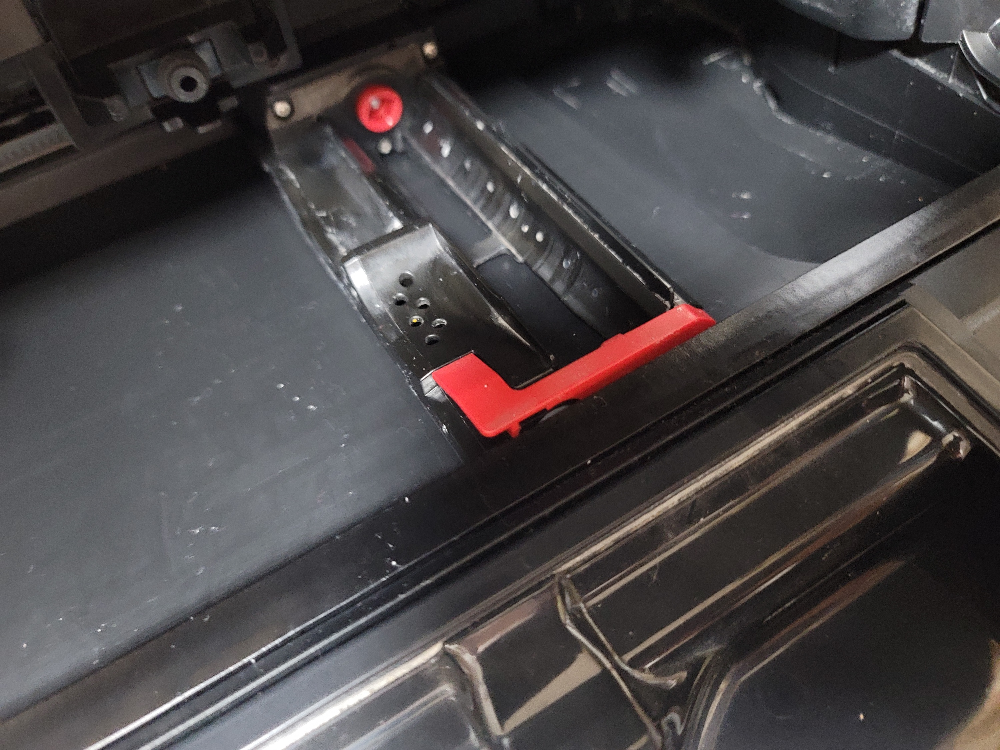

# 들어가면서
로봇청소기 글은 완전 망한 것 같다. 유입도 없고 감동도 없고...  
굳이 여기에 올려서 기술적이지도 않은 글로 흐리고...   
중국회사에서 만든 것이라 사람에 따라서 불안해 할 수도 있겠다 싶기도 하고
최근에 브러시에 뭐가 끼면 폭망이라서 원격 처리가 안되는 일이 종종있어 귀찮기도 하지만 여전이 그는 우리집의 수호자고 나의 살림 파트너이다.  
오늘도 나의 식기 세척기와 로봇청소기 그리고 의류 건조기에게 감사하며 나의 지난 근 3년을 돌아보려고 한다.  
매우 긴 글이고 두서 없이 쓸 것이고 중간 중간 back tracking 이 많이 일어나서 글의 관점을 잃고 해메다가 다시 돌아오고 할 것이다.  

# 이러려고 이런건 아니었다.
나는 인프라웨어를 나올때만 해도 마음이 좋지는 않았다. 같이 일하던 대학 동기와 헤어지면서 

## 같이 일하는 그가 퇴직하면서 흔들렸다.

# 이미 가지고 있는 데이터를 기반으로 사고하자
이미 로봇청소기라는 좋은 솔루션이 있다. 하지만 나에게는 불안함이 있다.

* 성능 - 턱이 있다든지 바닥에 뭐가 많다던지 우리 집엔 제약 조건이 많다.
* 신뢰 - 과연 잘 할까?

성능은 스팩 등을 살펴 보고 검증 데이터를 보면 된다. 하지만 신뢰. 이 신뢰의 문제가 잘 해결되지 않는다.  
하지만 이미 나는 `세탁기`, `건조기` 그리고 `식기 세척기` 를 거치며 일단 사고 보는 것이 얼마나 삶을 윤택하게 했는지 경험을 해 왔다.  
로봇 청소기역시 비슷하게 신뢰의 영역에서 문제가 발생하였지만 이전 선배 기기들이 거처온 그리고 가져온 결과를 보면 아마 신뢰는 그저 미신과 같을 가능성이 크다.  
그럼 스팩과 실제 그 스팩이 동작하는 지만 검증하자.
(`식기 세척기`는 실제로 부부싸움을 50% 이상 감소 시켰다. 아맨. 왜 그제서야 샀을지 후회하며 쓰는 제품이다.)

일단 턱을 잘 넘어야 하고, 나를 위해서는 물걸레 질을 잘 해야 하며 마지막으로 유지보수가 간단해야 한다.

과정 생략... [로보락 S8 프로 울트라](https://kr.roborock.com/pages/roborock-s8-pro-ultra?gad_source=1&gclid=CjwKCAiA3aeqBhBzEiwAxFiOBisGKJVU_EeE1UWnajuTSeHf_4cMghndwxrLB1mvy3ozg2InBTvySBoCn-wQAvD_BwE) 너로 정했다.  
사실 최저가라고 해서 샀지만 최저가는 언제나 갱신된다.  
마치 나의 카카오 주식 혹은 네이버 주식... 그리고 현대백화점 & 한섬 주식 처럼  
슬프다. 돈 있다고 주식하지 말자. (지만 유한양행 숏 한번 하고 주LG 샀다. 제발 우승해라 LG)

# 사진을 곁들인 후기
로보락을 사용할 때 해야 할 것은 오수통을 매일 닦아 주어야 한다. 그러면 냄새고 뭐고 없다. 바닥을 다 닦을 판이었는데 오수통 하나 닦는 것 큰 문제 아니더라.  2일 지나면 안에 먼지 가라 앉으면서 굳으니 1일이 적당하다 생각한다.  

씻어 놓고 살짝 말려 보자. 저 오수통 옆에 희안한 것이 있는데 이것을 이제 이야기 하려고 한다.

한달에 한번 정도 걸레 청소 유닛들을 다 빼서 치워야 한다.  
걸레 닦는 솔과 걸레 빨고 먼지 여과하는 유닛 그리고 그 들이 닿아 있는 부분을 청소하는 것이 은근 까다롭다.  
나는 보통 물티슈를 활용하여 스스슥 닦긴 하지만 완전 깔끔하게 잘 안닦인다.  
나의 기간인 1달 보다 짧은 기간으로 설정하고 먼지 상태를 세밀하게 확인하여 유지보수가 가능한 시점을 잡을 수도 있겠지만...  
귀찮다.  
사실 이 지점이 로보락의 가장 귀찮은 지점이다.  
하지만 알아서 걸레도 빨고 먼지통도 비우는데 뭐 이정도는 할만하지 않나 싶다.  

먼지 청소하는 롤러는 청소가 개꿀이다. 다이슨의 롤러 옆 머리카락 지옥을 경험한 사람에겐 이 시스템은 거의 천국과 같다.  그냥 스륵 분리가 된다.  
로보락 만세!!  
분리도 원터치로 쉽게 만들어 놓았다.  
다만 여기가 청소할 때 막히면 그냥 로봇 청소기가 멈춘다. 은근 민감함 부분이기도 하다.  

내가 특별히 빨지 않고 2달간 이 시스템이 알아서 유지보수하고 있는 걸래의 상태이다.  
아름답다.  
뭐 이정도면 참 믿음가는 동료이다.

먼지통은 당연히 작고 사실 로봇청소기에게 바라는 것은 큰 덩어리의 쓰래기를 완벽하게 없애는 것은 아니다.  
분리되고 세척된다.  하지만 이 필터를 건드리게 되면 먼지를 맛보게 될 것이다.  
다이슨 분리 청소할 때 해파필터 생각해보면 감이 올 것 이라고 생각이 든다.

# 마치면서

로보락은 두려움이 없다. 본인지 다칠지 판단하지 않고 일단 들어간다고 판단하면 본인의 몸을 스윽 밀어 청소를 진행한다.  
용감한 동료가 있어 나의 점심은 보다 분리수거 되고 재료 손질되는 점심이 되었다.  

최근 일정에 쫓기며 작업을 했었고 - 마지막 불꽃일지도 모르고 불태웠다. - 나의 명예 등을 위해 회사를 나와 무소속 상태로 지내고 있다.  

누구 혹은 어디를 신뢰해야 할지 모를 때 미신에 갖혀 있지 않고 데이터를 기반으로 잘 판단하여 현실적으로 나에게 어떠한 선택지가 있을지 잘 판단해야 겠다.  
그 결과 나는 본인의 온전함 마져 버린 - 사실 충돌 관련 코드가...ㅎㅎㅎ 오늘은 코드 나 개발 이야기 말자 - 동료를 얻을 수 있었다.  

이렇게 어색한 개발블로그(?) 상의 주부탬 킹 주부탬 로보락 S8 프로 울트라 후기를 마친다.  
전혀 전혀 매우 안탁갑게도 협찬 받지 않았으며 나의 돈으로 구매하여 내가 생각한 것을 작성하였다.  
부디 redis cli 를 넘는 광고 수익을 기대해본다.

