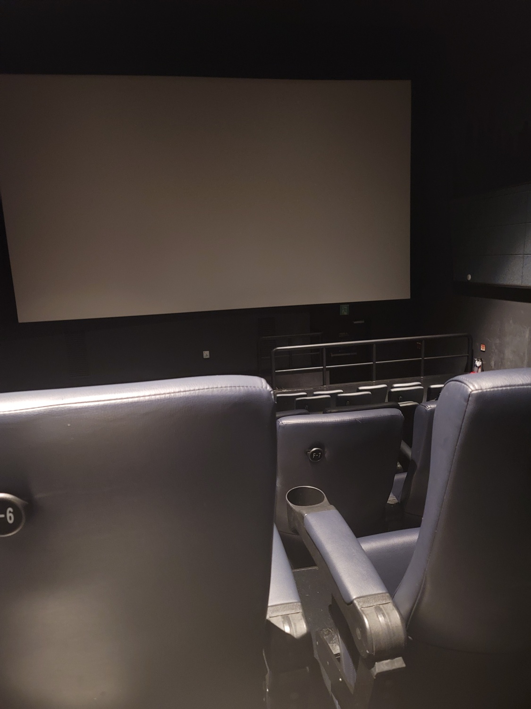

# 영화관에 가다

6년 만에 영화관이라는 곳을 가봤다. 첫째가 태어나고 영화관에를 가볼 생각을 못해봤다. 그래도 17년 9월에 시간이 나서 `김광석`이라는 영화를 봤었다. 뭐 김광석을 엄청나게 좋아하는 편은 아니었지만 그 당시 이슈가 되었고 뭐 시간도 괜찮아서 봤었다. 이번엔 SKT VIP 의 특권중 연 3회 무료 영화를 소진하기 위해서 `서울의 봄` 이라는 영화를 선택했다. 아이들 등원/등교 하고 나서 시간이 괜찮기도 하고 이슈도 되고 그래서 영화를 보러가게 되었다. 흠.. 나는 변한 것이 별로 없는 듯 하다.  

# 영화는?
영화를 보고 마지막에 군가가 나오는 데 나도 모르게 울었다. 정말 지겨웠다. 그 군가. 행군중에 구보중에 그렇게 불렀다. 작게 부르면 혼났고 또 혼났다. 군가를 가르쳐주는데 악보도 안주고 그냥 구전으로 알려준다. 음이 다 지맘대로다. 이게 뭔뜻인가 하고 음미할 시간도 없다. 그냥 모르면 혼났던 그런 군가인데... 다 듣고 울고 나왔다.  

# 악은 그저 악
내가 영화나 연기 전혀 모르고 그냥 좋아라 보기만 하는 사람이지만, 황정민 배우는 참 스팩트럼이 넓다. 목소리가 변하지도 않고 표정도 그냥 그냥인데 배역마다 느낌이 다르다. 나는 집에 있으면 `신세계`를 그렇게 보는데 아내가 참 싫어한다. 어쨌든 보면 신세계 느낌이 날 수도 있다. 하지만 큰 차이가 있었다. 신세계나 여타 다른 영화에서 보지 못한 `희화 하지 않는다` 였던 것 같다. 사실 이 역은 더 오바하거나 더 내리거나 해서 파장을 크게 줄 수 있다. 그래서 더 사람들에게 인상이라는 것을 남길 수 있다. 사실 처음 나온 영상물은 아니다 보니 여러 분들이 이 역할을 하셨었다. 최근 생각나는 것은 `이덕화` 님의 연기였는데, 사실 워낙 나에게는 호감형이고 남성스러운 면이 있기도 해서 그런가, 이 역을 약간 본인의 호감적인 매력으로 풀어간다는 생각이 들었다. 그래서 잘 안보게 되었던 것 같다. 하지만 이번 영화에서는 전혀 그런 점을 찾아보기 어려웠다. 정확히 거만하고 정확히 악하다. 정확히 조롱하고 정확히 기뻐한다. 사실 황정민 배우도 호감의 매력도 많고 무서운 얼굴도 많을 것이다로 생각한다. 하지만 그렇지 않았다.

## 오버엔지니어링 vs 언더엔지니어링
사실 나는 오버엔지니어링을 좋아하는 것 같다. 더 많은 시간을 쓰고 더 우연하게 만들어서 무슨 요구사항이 와도 다 쓸어버리고 싶은 것 같다. 그래서 더 많이 준비하고 더 깊게 생각한다. 그래서 다른 요구 사항이 나왔을 때, `여기요!! 그럴 줄 알았어요` 하고 싶어 하는 것 같다. 그런데 이 지점은 참 동료간의 신뢰에서도 별로인 것 같고 시간을 맞춰 무언가를 만들 때 참 장애가 된다. 그럼 최소한으로 해서 만들어 나가는 것이 중요할까? 그렇지도 않다. 그냥 돌아만 가게 했는데 이를 기반으로 실제품을 만들자고 할 때 보통 이렇게 말한다. `리펙토링이 필요합니다.` 흠... 나만 그런가 싶기도 하지만 보통 가능성만 본 것은 보통 버리고 새로 만든다. 그럼 빠르게 실행한 의미가 없어진다.

## 철저한 레벨링
아마 한번에 결과물이 나오지 않았을 것이라 생각한다. 배우가 연기를 내기까지 스스로 연구한 레벨링이 있을 것이고 현장에서 즉흥성에 발현된 무언가가 있을 것이고 그것을 차분하게 정형화한 감동의 레벨링도 있었을 것이라 생각한다. 어떤 배역을 만들어가는가에 대해서 많은 사람들의 의견이 담긴다. 그리고 실제 실연하는 배우의 실체에서 실존적으로 발현된다. 아마 이 지점에 많은 고민이 있었을 것이라고 생각한다. 촬영전에 아마 많은 의견이 오갔거나 아니면 각자의 자리에서 수련이 있었을 것이라고 생각한다. 그리고 정확한 커뮤니테이션을 통해서 정확한 선들이 만들어 졌을 것이라고 생각한다.  
즉흥에는 항상 한계가 있다고 생각한다. 물론 천재들에게는 다르겠지만 나같은 범인에게는 즉흥으로 계속 끌고 가기에는 무리가 있다. 언젠가 한번 큰 실수가 나오기 때문이다. 어떠한 스팩 혹은 스팩을 만들어가는 단계에 있어서 철저한 레벨링은 필요한 것이라고 생각한다. 오버엔지니어링은 나쁘지만 오버커뮤니케이션은 그런 입장에서 그렇게 나쁜 것은 아니라고 생각한다. 단지 귀찮은 것이지... 하지만 그 귀찮음이 웰메이드 - 소위 이야기 하는 높은 품질, 고퀄 - 을 만들어 낸다면 나쁘지 않을까 생각해본다.  

# 정우성의 얼굴은 그냥 옳다
20대 초반에 어느 영화관에서 정우성배우를 멀리서 본 적이 있었는데 너무 떨려서 한발자국도 못움직였던 기억이 있다. 세상 어떤 사림이 이렇게 생겼을까 싶었다. 하지만 세월이 지났고 사람은 나이를 먹으니 외모는... 이 아닐 수 있는 사람이 있는 것을 깨달았다.  

## 장태완 장군의 이름이 안떠올랐다.
`이태신` 만 떠올랐다. 실제로 수방사령관은 많은 분들이 역을 했었고 실존 인물도 미디어를 통해 봤었기 때문에 이러한 이미지로 생각해본 적은 한번도 없는 것 같다. 튼튼하고 견고하지만 강인하고, 약하지만 부러지지 않는 이런 이미지는 참으로 생각해본적이 없다. 보통 다른 미디어에서는 이렇게 호소력이 있지 않았던 것 같다. 약간 나약하게 욕을 하는 데도 이렇게 멋진지...

## 힘줄 부분은 과장해도 좋을 것 같다.
사실 이날은 거의 전화로만 상황을 처리하는 것으로 알고 있다. 하지만 이리뛰고 저리 뛰고 자신의 부대로 인해서 큰 사단이 난 것을 아파하고 힘들어하며 끝까지 극복해보려는 것에 대해서는 왜곡이라는 표현을 할 수 없었다. 그저 아름다웠다. - 이 분은 나이가 들면 그 나이때의 가장 아름다운 얼굴이 되는 것은 또 뭘까.  
어쨌든 엔지니어링에서도 똑같이 전해야 할 메세지에 대해서는 더 도드라지게 표현해야 하는 것이 필요하다고 생각한다. 주력은 아니겠으나 주력을 더 돋보이게 하는 그 무언가는 만든 결과물의 매력을 높이는 것이라고 생각한다.  

# 훌륭한 동료
언젠가 야후 CEO 의 발언을 듣고 나도 그렇게 살아야지 싶었다. 훌륭한 사람들이 있는 팀으로 계속 가다보니 CEO 가 되었나 정도였는데, 사실 그 분은 이미 훌륭한 분이라서 뭐 잘되었을 것이라고 생각하지만 야후의 마지막이 되었으니 어찌 평가 받을지는 나로서는 잘 모르겠다. 하지만 나에게는 큰 영함을 준 사람임에는 틀림없다. - 네스케이프 이거나 아니다 판단 덕에 크나큰 아픔을 주었던 YUI 도 있으니 영향을 준 것은 맞다.  
이번 배우 케스팅을 보면 쉴 곳이 없다. 잠깐나오는 하지만 중요한 부분을 연기한 김오랑 중령역마저 정해인 배우가 연기를 하였다.  

## 솔직히 정형적이지 않은 그 말 시너지
시너지라는 말을 별로 좋아하지 않는다. 2명 배정해 놓고 시너지 내서 3명분해 라는 말로만 듣다보니 그런 것 같기도 하다. 하지만 어느 정도 알고는 있다. 실력이 출중한 사람들 끼리 마음을 열고 모이면, 기본적인 base 에 대한 논의가 그닥 없다. 그래서 빠르게 협업을 시작한다. 그리고 빈 곳을 알아서 채워가면서 서로의 역할을 스스로 올리고 내린다. 이 영화에서는 이러한 것을 확실히 본 것 같았다.  

# 마치며
영화는 내가 평론하거나 할 그런 것은 되지 않는다. 뭐 군가 속으로 따라 부르면서 울고 말았으니 평은 이정도로 하려고 한다.  
하지만 마치면서 나는 어떤 제품을 만들지에 대해서 생각을 다시 정리해보았다. - 영화만 보고 오지 다른 것에 전이시키는 그런 오버엔지니어링이 싫다고 아내가 말하지만 정리해보았다.  
개발 수준을 유지하는 방법에 대한 고민, 제품의 매력도를 나타낼 부분을 찾는 것에 대한 고민 그리고 좋은 동료가 되는 법에 대한 고민을 하며 답없는 서울의 봄 감상을 마치려고 한다. 서울의 봄 같은 제품을 만들어 보고 싶다.
